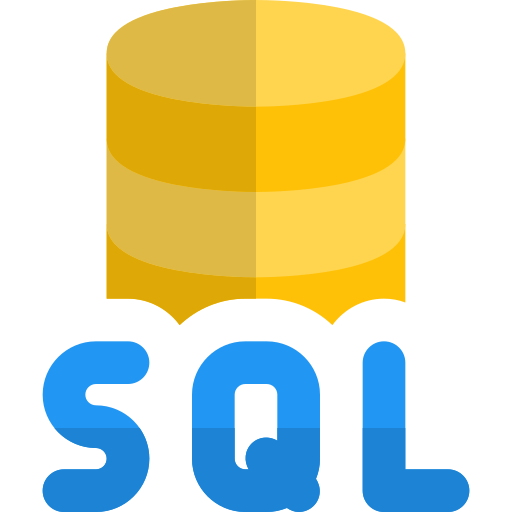

<h1 align="center">👋 Olá, eu sou o Mateus</h1>

<h3 align="center">Desenvolvedor | Java | Flutter | Laravel | Bancos de Dados | Integrações</h3>

  Apaixonado por tecnologia, desenvolvimento de software e soluções que conectam sistemas, dados e pessoas.

---

## 🚀 Sobre mim

Sou formado em **Ciência da Computação** e atuo na área de tecnologia com foco em desenvolvimento de sistemas, integrações e soluções backend.

Tenho experiência com desenvolvimento **mobile usando Flutter**, backend com **Java**, **Laravel/PHP**, **Node.js**, bancos de dados relacionais e integrações entre sistemas corporativos.

Atualmente, estou aprofundando meus conhecimentos em:

- Java com Quarkus
- APIs REST
- Bancos de dados Oracle, SQL Server e PL/SQL
- Integrações entre sistemas
- DevOps

---

## 🎯 Objetivo profissional

Evoluir continuamente como desenvolvedor, criando soluções robustas, escaláveis e bem estruturadas, com foco em backend, integrações, automações e arquitetura de sistemas.

---

## 👨‍💻 Tecnologias e Skills

### Front-End

  
  
  
  
  

### Back-End

  
  
  
  
  

### Banco de Dados

  
  
  

### Mobile

  

### Versionamento

  
  

### Outros

  

---

## 📊 GitHub Stats

  

---

## 🌐 Onde me encontrar

---

